I finally grew tired of having to randomly follow at least three guides (and possibly have to re-work my install at least two more times before it's ready) to setup Arch my normal way, so instead I figured I'd create this somewhat useful guide.

I'm not going into full detail of the steps performed, as they're listed on the guides I used.

After this guide is complete, Arch with KDE Plasma for a DE will be setup!

You may notice I opt for a cold start instead of rebooting. This is because of bugs within the Pinebook's wifi firmware. This is my preference, and `reboot` can be subbed in any place where `shutdown -h now` is noted.

For a guide to setup of a MicroSD in a USB adapter, follow [this guide](https://github.com/OGLTE/PineBookProArchSetup)

**NOTE**: Following this guide WILL overwrite all MicroSD and EMMC contents.

Moving on.

**Guides used**:
- [x] [Installing Arch Linux on a PineBook Pro (external storage)](https://www.lorenzobettini.it/2022/12/installing-arch-linux-on-a-pinebook-pro-external-storage/)
     - I follow this guide until I reach the point where a DE is being installed and then move to the itsfoss guide below
- [x] [How to Properly Install and Setup KDE Plasma on Arch Linux](https://itsfoss.com/install-kde-arch-linux/)
     - I prefer this DE for my use case

Neither of the two main guides (Pine64's own and the other guide here on GitHub) I followed worked out of the box. So I ended up following Lorenzo Bettini's guide which worked every time! (provided I didn't mess up a step)

Also, I have a [Raspberry Pi USB WiFi Dongle](https://www.raspberrypi.com/products/raspberry-pi-usb-wifi-dongle/) that I will be using until the PineBook Firmware is loaded, so your steps leading up to installing firmware will likely vary, YMMV.

## Prerequisites
 - An existing Arch or Manjaro install must be used on the PineBook Pro for setup.
     - Following the Manjaro install guide will get you to a usable system to install from
     - `pacstrap` will be needed to install applications
- I prefer `axel` to `wget`, and I will be referencing it instead of `wget` in scripts. 
 - a MicroSD card to install Arch onto (naturally) at least 8GB in size
 - Internet access or *somewhat* recent downloads of:
     - `Tow Boot`: I used the version released on 10/05/2021 [from here](https://github.com/Tow-Boot/Tow-Boot/releases/download/release-2021.10-005/pine64-pinebookPro-2021.10-005.tar.xz)
     - [ARM Arch Linux install image](http://os.archlinuxarm.org/os/ArchLinuxARM-aarch64-latest.tar.gz)
          - [relevant signiture](http://os.archlinuxarm.org/os/ArchLinuxARM-aarch64-latest.tar.sig)
 - I do recommend conenction via SSH after rebooting into Arch from MicroSD, as there are some lengthly commands to type out, some which contain signing keys and are a pain to type out manually.
# MicroSD Setup
## Downloading Tow-Boot and flashing
 - All of the following commands must be run as `root` so you must become `root`

       sudo su -
 - I perform the following commands in `Downloads`

       cd Downloads
       axel -a https://github.com/Tow-Boot/Tow-Boot/releases/download/release-2021.10-005/pine64-pinebookPro-2021.10-005.tar.xz
       tar xvf pine64-pinebookPro-2021.10-005.tar.xz
 - use `lsblk` before running the following to figure out which device you will be flashing Tow Boot and change if needed
 
       dd if=pine64-pinebookPro-2021.10-005/shared.disk-image.img of=/dev/mmcblk1 bs=1M oflag=direct,sync status=progress
## Creating root and boot partitions
 - Run `fdisk` to create partitions on this device

       fdisk /dev/mmcblk1
      - Create second parition (defaults are fine for all but the partition size)

            Command (m for help): n
            Partition number (2-128, default 2): 
            First sector (24640-62521310, default 26624): 
            Last sector, +/-sectors or +/-size{K,M,G,T,P} (26624-62521310, default 62519295): +256M

            Created a new partition 2 of type 'Linux filesystem' and of size 256 MiB.
      - Change to expert mode

            Command (m for help): x

     - Make parition bootable

           Expert command (m for help): A
           Partition number (1,2, default 2): 

           The LegacyBIOSBootable flag on partition 2 is enabled now.
     - Exit expert mode

           Expert command (m for help): r
     - Create third partition (defaults are fine here)

            Command (m for help): n
            Partition number (3-128, default 3): 
            First sector (550912-62521310, default 550912): 
            Last sector, +/-sectors or +/-size{K,M,G,T,P} (550912-62521310, default 62519295): 

            Created a new partition 3 of type 'Linux filesystem' and of size 29.5 GiB.
       - If the card was used before, you'll get a warning about existing signiture removal

              Partition #3 contains a ext4 signature.

              Do you want to remove the signature? [Y]es/[N]o: y

              The signature will be removed by a write command.
     - Write changes to disk 

           Command (m for help): w
           The partition table has been altered.
           Calling ioctl() to re-read partition table.
           Syncing disks.
## Formatting root and boot partitions
 - Format and mounting `root` and `boot` partitions

       mkfs.ext4 /dev/mmcblk1p2
       mkfs.ext4 /dev/mmcblk1p3
 - Mount `root` and `boot` partitions

       mount /dev/mmcblk1p3 /mnt
       mkdir /mnt/boot
       mount /dev/mmcblk1p2 /mnt/boot
## Downloading and extracting Arch Arm Installer image to root partition
 - Download the Arch ARM Installer image and verify it via gpg

       axel -a http://os.archlinuxarm.org/os/ArchLinuxARM-aarch64-latest.tar.gz
       axel -a http://os.archlinuxarm.org/os/ArchLinuxARM-aarch64-latest.tar.gz.sig
       gpg --keyserver keyserver.ubuntu.com --recv-keys 68B3537F39A313B3E574D06777193F152BDBE6A6
       gpg --verify ArchLinuxARM-aarch64-latest.tar.gz.sig
 - Expand the image to `root` partition

       bsdtar -xpvf ArchLinuxARM-aarch64-latest.tar.gz -C /mnt
## Adjusting fstab and exlinux.conf
 - Add the `root` partition info to `/mnt/etc/fstab`

       blkid /dev/mmcblk1p3 >> /mnt/etc/fstab
 - Run `nano /mnt/etc/fstab` to adjust this file

       nano /mnt/etc/fsstab
 - `fstab` contents will be similar to the following

       # Static information about the filesystems.
       # See fstab(5) for details.

       # <file system> <dir> <type> <options> <dump> <pass>
       /dev/mmcblk1p3: UUID="858802ab-cd7f-4ea2-8865-f3d596ea9661" BLOCK_SIZE="4096" TYPE="ext4" PARTUUID="3edfbfe3-2c6c-4ab7-8bfb-e5dce0c5fe11"
 - Line five will need to be adjusted similar to the following

       UUID=858802ab-cd7f-4ea2-8865-f3d596ea9661       /       ext4    defaults        0       1
     - The string after `UUID=` will match your UUID for partition 3
 - Save and exit by pressing `CTRL+X` then pressing `y` then `ENTER`
 - Add the `boot` partition info `/mnt/etc/fstab`

       blkid /dev/mmcblk1p2 >> /mnt/etc/fstab
 - Run `nano /mnt/etc/fstab` again to adjust
       
       nano /mnt/etc/fstab
 - `fstab` contents will be siliar to the following

       # Static information about the filesystems.
       # See fstab(5) for details.

       # <file system> <dir> <type> <options> <dump> <pass>
       UUID=858802ab-cd7f-4ea2-8865-f3d596ea9661       /       ext4    defaults        0       1
       /dev/mmcblk1p2: UUID="609da8e6-9564-4cbf-80fc-770548b0abec" BLOCK_SIZE="1024" TYPE="ext4" PARTUUID="8d7e1eed-c3e8-4e9a-a8cb-7b64215cbe46"
 - Line six will need to be adjusted similar to the following

       UUID=609da8e6-9564-4cbf-80fc-770548b0abec       /boot   ext4    defaults        0       2
     - the string after `UUID=` will match your UUID for partition 2
 - Save and exit by pressing `CTRL+X` then pressing `y` then by `ENTER`
 - Create `extlinux` directory within `/mnt/boot`

       mkdir -p /mnt/boot/extlinux
 - Add the `root` partition info to `extlinux.conf` file

       blkid /dev/mmcblk1p3 >> /mnt/boot/extlinux/extlinux.conf
 - Run `nano /mnt/boot/extlinux/extlinux.conf` to edit this file

       nano /mnt/boot/extlinux/extlinux.conf
 - Copy the following and paste into `extlinux.conf` file

       DEFAULT arch
       MENU TITLE Boot Menu
       PROMPT 0
       TIMEOUT 50

       LABEL arch
       MENU LABEL Arch Linux ARM
       LINUX /Image
       INITRD /initramfs-linux.img
       FDT /dtbs/rockchip/rk3399-pinebook-pro.dtb
       APPEND root=UUID=7f7965a3-e04a-4e6b-ae6b-f8110202c61b rw

       LABEL arch-fallback
       MENU LABEL Arch Linux ARM with fallback initramfs
       LINUX /Image
       INITRD /initramfs-linux-fallback.img
       FDT /dtbs/rockchip/rk3399-pinebook-pro.dtb
       APPEND root=UUID=7f7965a3-e04a-4e6b-ae6b-f8110202c61b rw
 - UUID on line 11 will need adjusted similar to the followng (replace with UUID for your `root` partiton)

       APPEND root=UUID=858802ab-cd7f-4ea2-8865-f3d596ea9661 rw
 - UUID on line 18 will need adjusted similar to the following (replace with the UUID for your `root` partition)

       APPEND root=UUID=858802ab-cd7f-4ea2-8865-f3d596ea9661 rw
 - Save and exit by pressing `CTRL+X` then pressing `y` then by `ENTER`
 ## Installing dialog and wpa_supplicant
 - We'll need to install `pacstrap` if it isn't already

       sudo pacman -Syu arch-install-scripts
       :: Synchronizing package databases...
       core is up to date
       [...]
       :: Starting full system upgrade...
       resolving dependencies...
       looking for conflicting packages...

       Packages (1) arch-install-scripts-28-1

       Total Download Size:   0.02 MiB
       Total Installed Size:  0.05 MiB

       :: Proceed with installation? [Y/n] y
       :: Retrieving packages...
       arch-install-scripts-28-1-any             15.4 KiB  32.2 KiB/s 00:00  [#######################################] 100%
       (1/1) checking keys in keyring                                        [#######################################] 100%
       (1/1) checking package integrity                                      [#######################################] 100%
       (1/1) loading package files                                           [#######################################] 100%
       (1/1) checking for file conflicts                                     [#######################################] 100%
       (1/1) checking available disk space                                   [#######################################] 100%
       :: Processing package changes...
       (1/1) installing arch-install-scripts                                 [#######################################] 100%
       :: Running post-transaction hooks...
       (1/1) Arming ConditionNeedsUpdate...

 - Run `pacstrap -K /mnt dialog wpa_supplicant` to install `dialog` and `wpa_supplicant` otherwise `wifi-menu` will not run after we boot off of MicroSD

       pacstrap -K /mnt dialog wpa_supplicant
       ==> Creating install root at /mnt
       ==> Installing packages to /mnt
       :: Synchronizing package databases...
       core is up to date
       [...]
       resolving dependencies...
       looking for conflicting packages...

       Packages (5) duktape-2.7.0-6  pcsclite-2.0.0-1  polkit-122-1  dialog-1:1.3_20230209-1  wpa_supplicant-2:2.10-8

       Total Download Size:    2.04 MiB
       Total Installed Size:  10.45 MiB
       Net Upgrade Size:       9.99 MiB

       :: Proceed with installation? [Y/n] 
       :: Retrieving packages...
       wpa_supplicant-2:2.10-8-aarch64        1446.1 KiB  1055 KiB/s 00:01  [######################################] 100%
       polkit-122-1-aarch64                    385.6 KiB  1252 KiB/s 00:00  [######################################] 100%
       duktape-2.7.0-6-aarch64                 158.7 KiB   887 KiB/s 00:00  [######################################] 100%
       pcsclite-2.0.0-1-aarch64                 96.5 KiB   567 KiB/s 00:00  [######################################] 100%
       Total (4/4)                               2.0 MiB   882 KiB/s 00:02  [######################################] 100%
       (5/5) checking keys in keyring                                       [######################################] 100%
       (5/5) checking package integrity                                     [######################################] 100%
       (5/5) loading package files                                          [######################################] 100%
       (5/5) checking for file conflicts                                    [######################################] 100%
       (5/5) checking available disk space                                  [######################################] 100%
       :: Processing package changes...
       (1/5) installing dialog                                              [######################################] 100%
       (2/5) installing duktape                                             [######################################] 100%
       (3/5) installing polkit                                              [######################################] 100%
       (4/5) installing pcsclite                                            [######################################] 100%
       (5/5) installing wpa_supplicant                                      [######################################] 100%
       :: Running post-transaction hooks...
       (1/4) Creating system user accounts...
       Creating group 'polkitd' with GID 102.
       Creating user 'polkitd' (PolicyKit daemon) with UID 102 and GID 102.
       (2/4) Reloading system manager configuration...
       Skipped: Running in chroot.
       (3/4) Arming ConditionNeedsUpdate...
       (4/4) Reloading system bus configuration...

 - Unmount the drives mounted to `/mnt`

       umount -R /mnt
 - Shutdown

       shutdown -h now
# EMMC Setup
Whew! That part is done. From here in you **will** need a live internet connection.

I **highly** recommend connecting via SSH for this section as there is a key signiture we will be verifying against. This will be covered in advance of the relevant step.

That said it's not 100% needed as I've completed this install manually typing in commands to be run quite a bit in the past with moderate levels of success!

I also **highly** recommend plugging your laptop into a power source before booting from MicroSD as we will NOT have a battery indicator until we have a DE.

## Updating Arch on MicroSD
You will need to select the MicroSD to boot from for this section.

When you're ready, power back up, then press `ESC` when the prompt on the bottom of your screen shows up.

Then select the SD card to boot from.

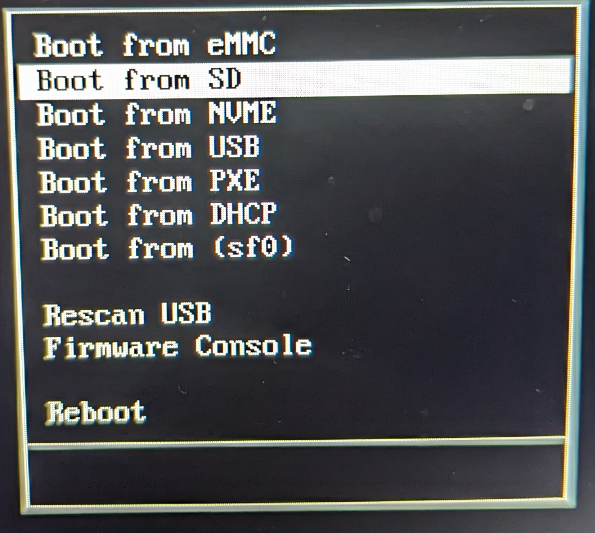

If the steps above were completed successffuly, it should boot to a login prompt.

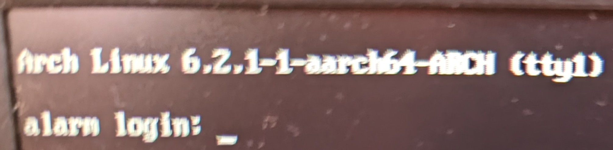

 - Login as `root`, password `root`
 - I recommend changing `root` and `alarm` passwords at this tine

       passwd
     
 - Enter your new `root` password
     
 - Confirm new `root` password
     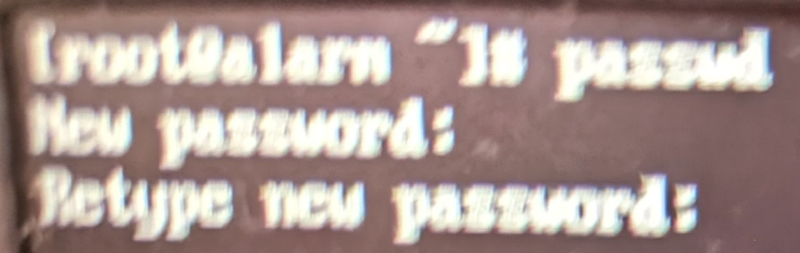
 - Change password for `alarm` user
       passwd alarm
 - Enter the new password for `alarm`
   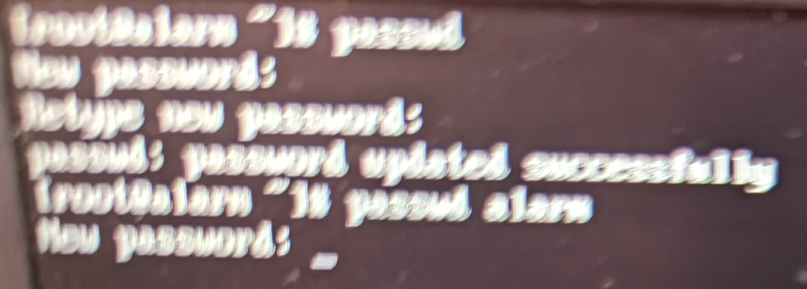
- Confirm password for `alarm`
   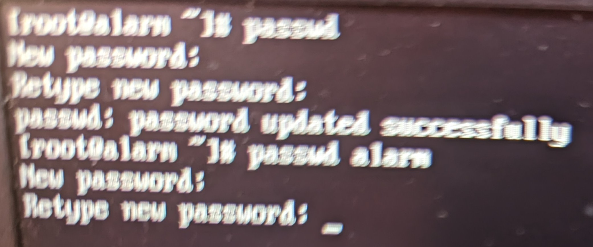
 - Run `wifi-menu` to connect to wifi (if needed)

     
     - wifi-menu will take a second to scan for networks
       
     - wifi-menu will display available networks
       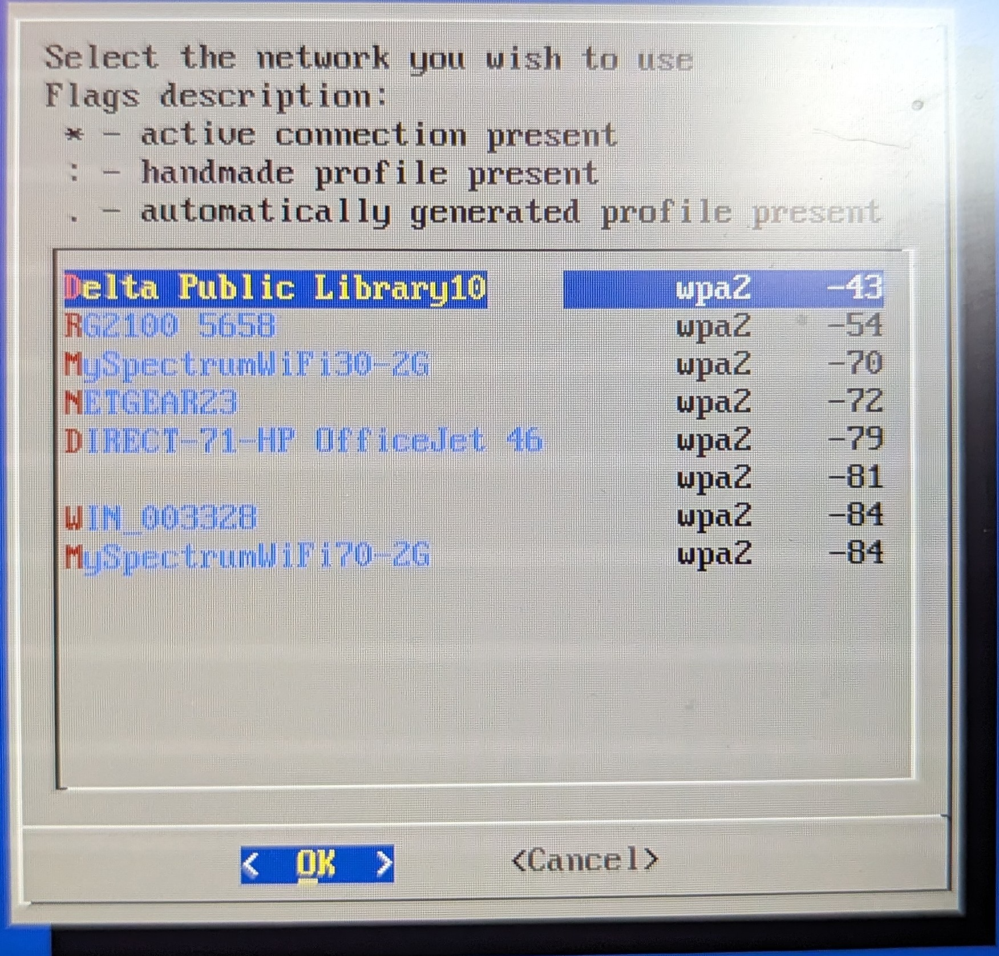
     - Press `enter` to select your wifi network
     - wifi-menu will prompt to save config
       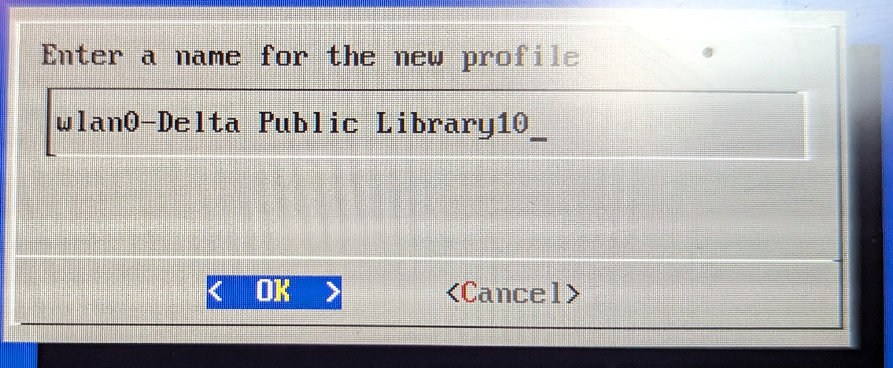
     - Enter wifi password
       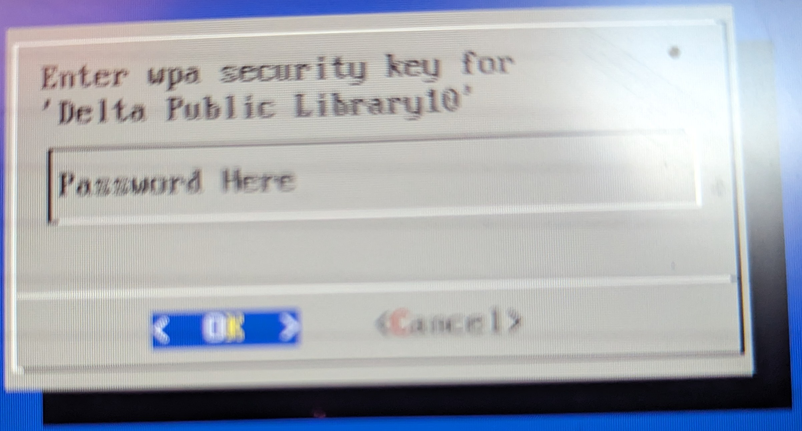
     - wifi-menu will exit
       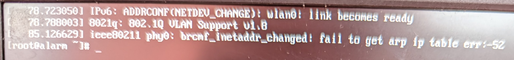
     - After a few seconds, you should have an ip. Run `ifconfig` to confirm
       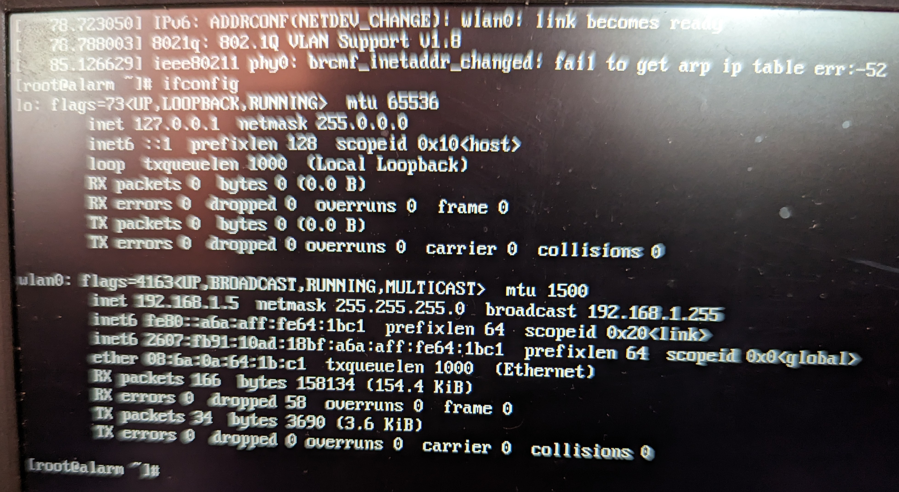
     - Ping `www.google.com` to confirm internet access
       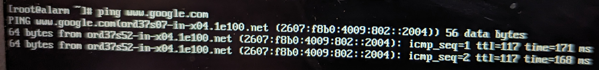

 - Initalize the `pacman` keyring and populate `archlinuxarm` 

       pacman-key --init
   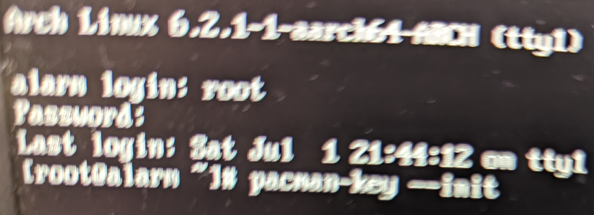
   
       pacman-key --populate archlinuxarm
   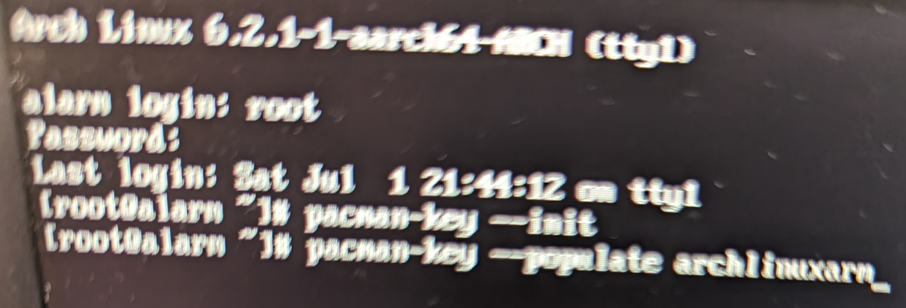
 - The pgp keys for the distribution will populate
   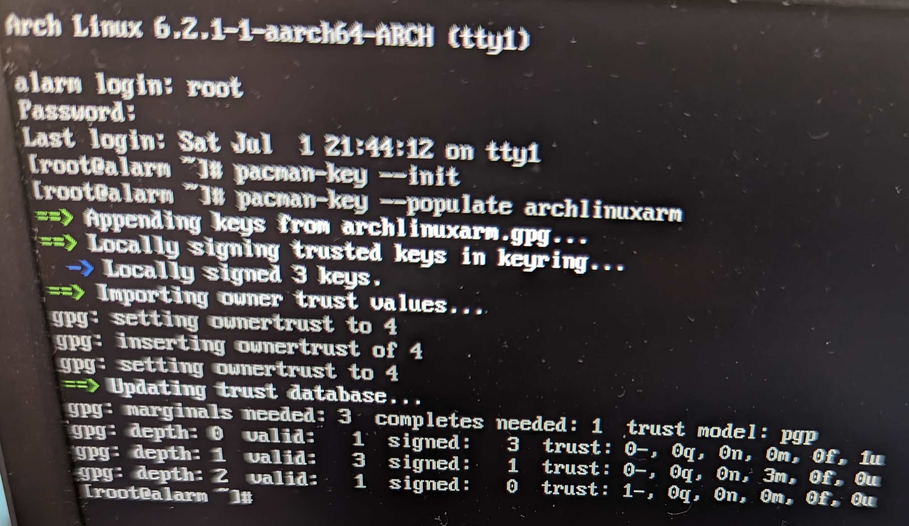
 - Sync time and date from `ntp` servers to hardware (I'm on the east cost and use `Detroit`)

       timedatectl set-timezone America\Detroit
   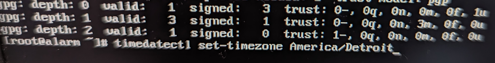
   
       timedatectl set-ntp on
   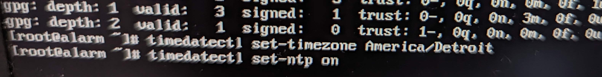
   
       hwclock --systohc
   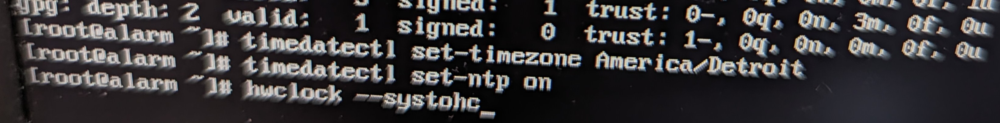
 - Config your `locale`

       nano /etc/locale.gen
   
- Press `CTRL+W` to bring up the `Search` dialog
  
- Type `#en_US` to search for the line we need to uncomment
  
 - Uncomment this line
   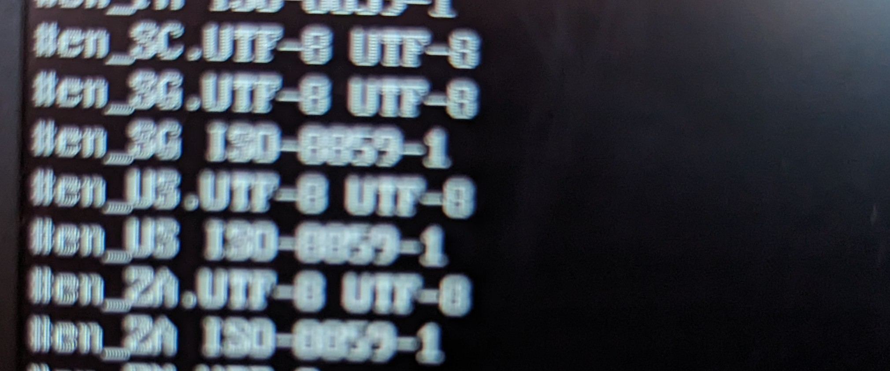
- Confirm it matches the following
  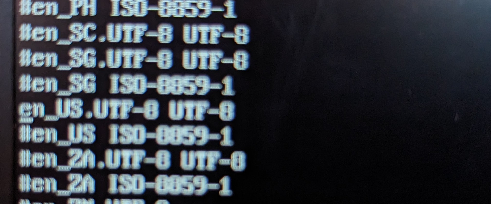
- If it does, then save and exit
 - Generate `locales`

       locale-gen
   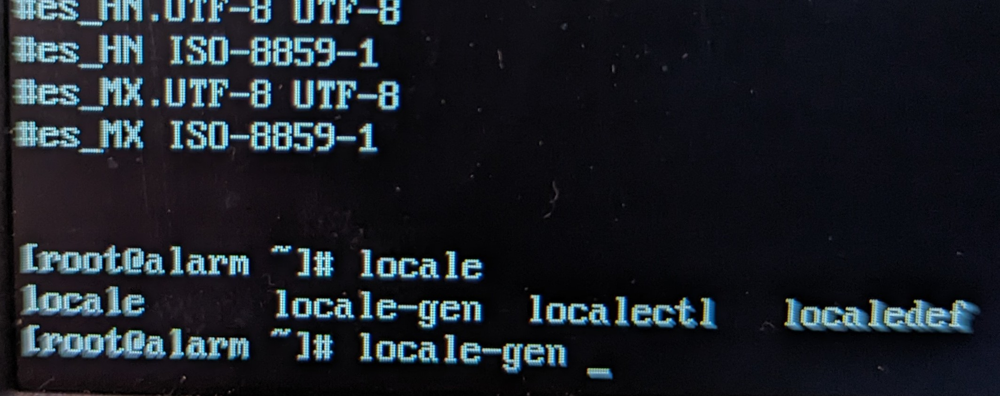
- This will load the uncommented locale
  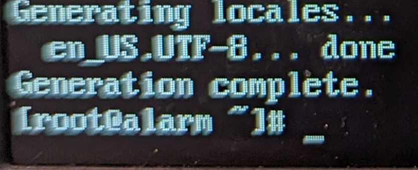
 - Edit `locale.conf` and set `LANG` to match the above

       nano /etc/locale.conf
 - Delete `C`
   
- Replace with `en_US.UTF-8` to match, then save/ exit
   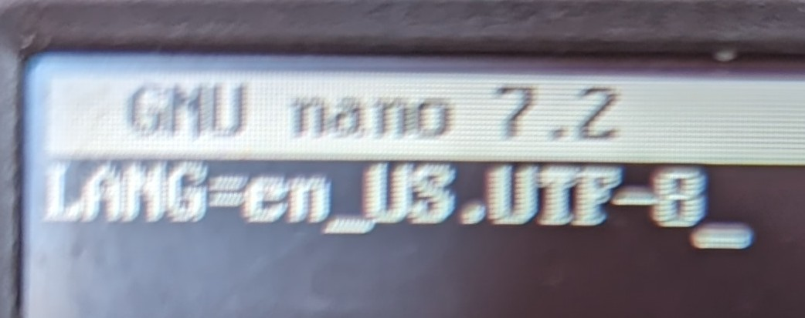
 - I typically update out of date packages at this time that way the OS on the MicroSD is up to date

       pacman -Syu
   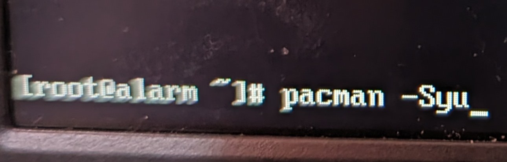
      - If pacman haults at the `alarm` repo for a long while (more than 30 to 60 seconds,) you may need to adjust your repos to use the `archlinuxarm`. mirror. A working pacman.conf is included in files
        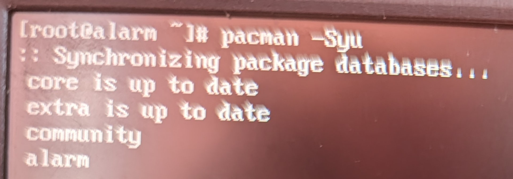
     - Updating all of the out of date packages will take some time
        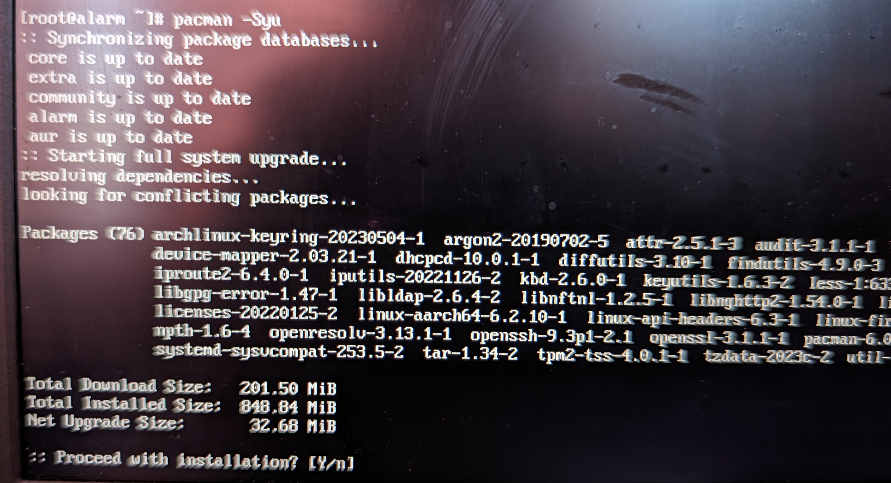
     - Just a few packages for me to update
      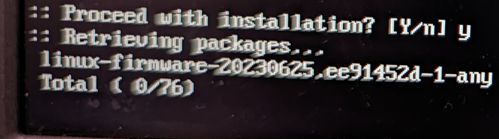
     - Almost done!
      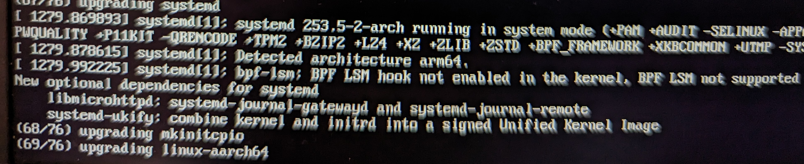
     - And done!
       
 - As long as there were no errors, we will install `sudo`

       pacman -S sudo
 - Edit `sudoers` to allow members of the group `wheel` to access `sudo`

       nano /etc/sudoers
 - Uncomment the line `# %wheel ALL=(ALL:ALL) ALL` and then save/ exit
 - Shutdown

       shutdown -h now

This will give you a 100% usable MicroSD running pinebook firmware, or skip to [here](https://github.com/infinitechris/PineBookProArchSetup/tree/main#writing-os-to-emmc) as the next steps will all be repeated on the Arch install on the EMMC.

## Installing Pinebook Firmware on MicroSD
Power back up your system to verify that everything updated correctly, hitting `ESC` when the prompt on the bottom of your screen appears, and selecting the MicroSD to boot from.

- When the login prompt appears, login as `alarm` at this point, so that we can ssh back in
  
- run `sudo wifi-menu` and connect to your AP
- run `ifconfig` to find your IP address
- On another device connect to your pinebook's ip address using ssh to your Pinebook
- Become `root` again, after logging in, as all of the following commands need to be run as `root` and not `sudo COMMAND`

       sudo su
- Add the kiljan pgp keys for the Pinebook firmware

       pacman-key --keyserver hkps://keys.openpgp.org/ --recv-keys A1EC3C686EF7A9DD232D1563D4D12D6AA6A92769
       pacman-key --lsign-key A1EC3C686EF7A9DD232D1563D4D12D6AA6A92769

       cat << 'EOF' >> /etc/pacman.conf

       [archlinuxarm-pbp]
       SigLevel = Optional TrustedOnly
       Server = http://pacman.kiljan.org/$repo/os/$arch
       EOF
 - Sync the repos

       pacman -Sy
 - Install the packages for the Pinebook firmware

       pacman -S ap6256-firmware libdrm-pinebookpro pinebookpro-audio pinebookpro-post-install towboot-pinebookpro-bin
 - Shutdown

       shutdown -h now

## Writing OS to EMMC
A lot of the following commands in the following section are the same as [MicroSD Setup](https://github.com/infinitechris/PineBookProArchSetup/blob/main/README.md#microsd-setup), as the majority of the changes are for the destination for `dd` 

Power back up your system to verify that everything is installed correctly, hitting `ESC` when the prompt on the bottom of your screen appears, and selecting the MicroSD to boot from.

 - When the login prompt appears, login as `root`
 - Create the `Downloads` directory

       mkdir Downloads
 - Change to this directory, download `Tow Boot`, then extract it

       cd Downloads
       axel -a https://github.com/Tow-Boot/Tow-Boot/releases/download/release-2021.10-005/pine64-pinebookPro-2021.10-005.tar.xz
       tar xvf pine64-pinebookPro-2021.10-005.tar.xz
 - use `lsblk` before running the following to figure out which device you will be flashing Tow Boot and change if needed
 
       dd if=pine64-pinebookPro-2021.10-005/shared.disk-image.img of=/dev/mmcblk1 bs=1M oflag=direct,sync status=progress
 - Create partitions on this device

       fdisk /dev/mmcblk1
 - `fdisk` commands to be added here as I follow back through this guide to make a backup EMMC
 - Format `root` and `boot` partitions

       mkfs.ext4 /dev/mmcblk1p2
       mkfs.ext4 /dev/mmcblk1p3
 - Mount `root` and `boot` partitions

       mount /dev/mmcblk1p3 /mnt
       mkdir /mnt/boot
       mount /dev/mmcblk1p2 /mnt/boot
 - Download the Arch ARM Installer Image and verify it via gpg

       axel -a http://os.archlinuxarm.org/os/ArchLinuxARM-aarch64-latest.tar.gz
       axel -a http://os.archlinuxarm.org/os/ArchLinuxARM-aarch64-latest.tar.gz.sig
       gpg --keyserver keyserver.ubuntu.com --recv-keys 68B3537F39A313B3E574D06777193F152BDBE6A6
       gpg --verify ArchLinuxARM-aarch64-latest.tar.gz.sig
 - Expand the image to `root` partition

       bsdtar -xpvf ArchLinuxARM-aarch64-latest.tar.gz -C /mnt
 - Copy `root` partition UUID to `/mnt/etc/fstab`

       blkid /dev/mmcblk1p3 >> /mnt/etc/fstab
 - Adjust `/mnt/etc/fstab` accordingly

       nano /mnt/etc/fstab
 - copy `boot` partition UUID to `/mnt/etc/fstab`

       blkid /dev/mmcblk1p2 >> /mnt/etc/fstab
 - Adjust `/mnt/etc/fstab` accordingly
       
       nano /mnt/etc/fstab
 - Create `extlinux` directory within `/mnt/boot`

       mkdir -p /mnt/boot/extlinux
 - Add the `root` partition UUID to `extlinux.conf` file
 - 
       nano /mnt/boot/extlinux/extlinux.conf
 - Add `pacstrap` install of `dialog` and anything else needed before shutting down and restarting here
 - Unmount the drives mounted to `/mnt`

       umount -R /mnt
 - Shutdown

       shutdown -h now
From this point on, we will be booting from the EMMC. You can still hit `ESC` then select this device, but the system will boot to EMMC by default as long as there's a bootable system installed there
## Installing Pinebook firmware to EMMC
The exact same steps from [Installing Pinebook Firmware on MicroSD](https://github.com/infinitechris/PineBookProArchSetup/tree/main#installing-pinebook-firmware-on-microsd) will be followed to the letter. So instead of me duplicating them here, I suggest following that section. The only difference is that wewill be booting from EMMC and not MicroSD

# KDE Plasma Setup
Now that we have firmware added to the EMMC, the MicroSD can be removed along with and dongles/ adapters you were using to install said firmware.

It's time to get a DE installed and get into our operating envirnment!
- After booting up and logging in as `alarm` lets make our personal user name that we'll be using going forward

       useradd -m triconda
 - give yourself a password

       passwd triconda
 - give yourself group permissions (add these here)
 - We will now install the following KDE prereqs and applications
     - Xorg group
     - KDE Plasma Desktop Environment
     - Wayland session for KDE Plasma
     - KDE applications

              pacman -S xorg plasma plasma-wayland-session kde-applications
 - Once the above completes, `enable` the `Displace Manager service`

        systemctl enable sddm.service

- Shutdown

       shutdown -h now
We're now ready to play around in a GUI and perform some needed Post-Install tweaks!
# Post-Install Tweaks
These are all applications that I install (chromium, snapd store, etc) to make the laptop into a more usable workstation
## KDE Tweaks
 - Dark mode / theme, power saving, login and lock screen setup here
## Yay AUR Helper
 - Install documentation here
## Snapd Store
 - Install documentation here
## Chromium
 - Install documentation here
## KDE Connect config
 - Simple walkthrough of app and android app setup
## Telegram
 - Install documentation here

# Other Notes
Right now, I have the following lines in `/etc/pacman.conf`:

     # Pacman won't upgrade packages listed in IgnorePkg and members of IgnoreGroup
     IgnorePkg   = generic-post-install pinebookpro-post-install
This is to ignore the two above packages from attempting to update through `core`, `extra`, `community`, `alarm`, and `aur` repos, which don't contain it and breaks any attempts at a system update right now for *some reason* yet to be found. Full `pacman.conf` that is working for me to this day is in [files](https://github.com/infinitechris/PineBookProArchSetup/blob/2d1a0ec5b527f502705739a9c55fa2c184ca0e95/files/pacman.conf)

I also have a mobile hotspot that I use to access the internet, and if I was previously on a *real* AP, I have found that I have to stop `NetworkManager` (if already running) or start (if not) and then stop it. Then `wifi-menu` itializes `wlan` fine
